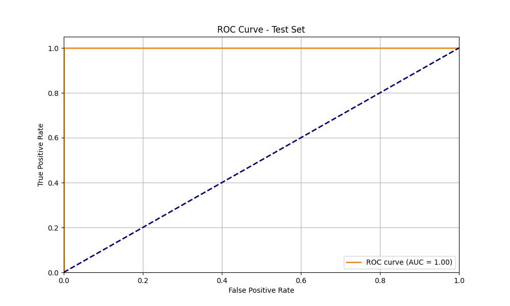
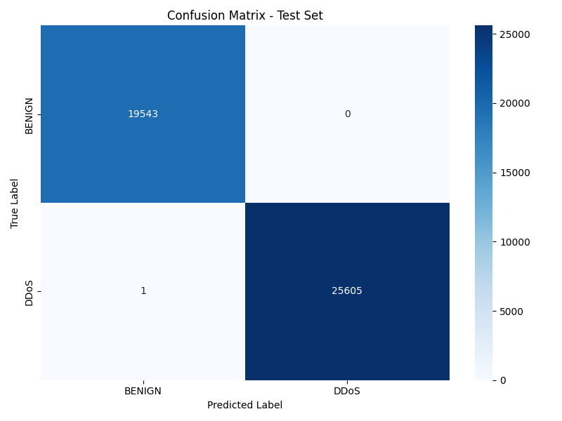
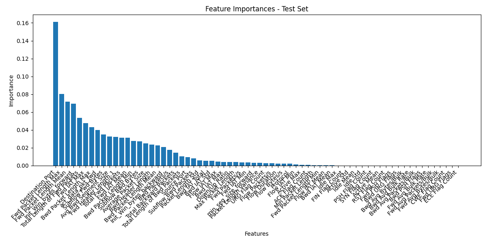
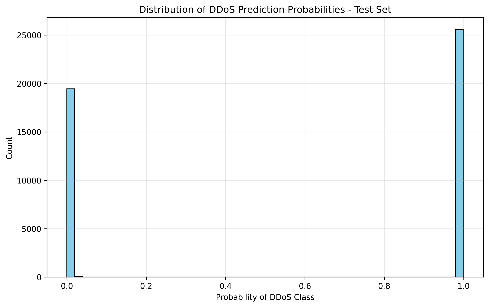
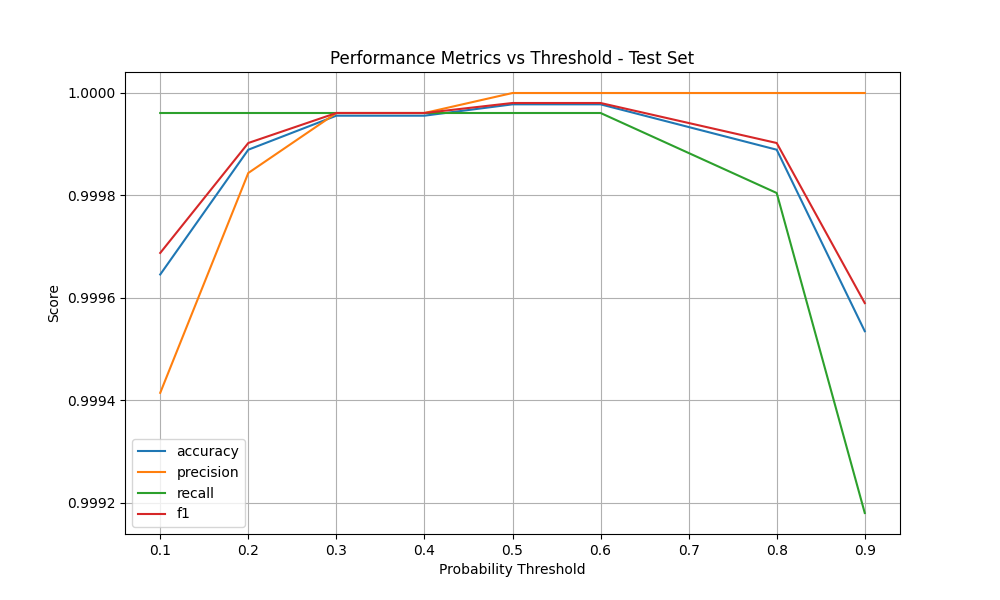

# DDoS Detection System Analysis & Design Notes

## Table of Contents
1. [Dataset Overview](#dataset-overview)
2. [Data Preprocessing](#data-preprocessing)
3. [Model Development](#model-development)
4. [Results Analysis](#results-analysis)
5. [Performance Visualization](#performance-visualization)

## Dataset Overview
Given the dataset, we have 84 features and 1 target variable("Label").

### Class Distribution
- **DDoS**: 56.71% (Attack traffic)
- **BENIGN**: 43.29% (Normal traffic)
- Mild class imbalance, handled through class weights

Due to the target feature containing only 2 classes, we will use StratifiedKFold for cross-validation with no data being imputed Typically, we consider a dataset to be highly imbalanced when the minority class has less than 10-20% of the total samples.

### Feature Composition
- 80 numerical features
- 4 identifier columns (dropped - they were just identifier columns and were not relevant for modelling)
  * Flow ID
  * Source IP
  * Destination IP
  * Timestamp

## Data Preprocessing

### Data Cleaning
Data columns have been cleaned and preprocessed to account for missing values, infinite values, duplicate rows and also the random spaces in the column names.
1. Missing Values: 0.015% (dropped)
2. Duplicate Rows: 0.02% (dropped)
3. Infinite Values: Replaced with NaN
4. Label Encoding: BENIGN → 0, DDoS → 1

### Data Split Strategy

- DDoS detection tasks can be sensitive to distribution drift, so it’s often beneficial to ensure that random sampling does not inadvertently end up with mostly similar flows in train or test sets.
- This ensures the model generalizes rather than memorizes a specific subset of flows.

- Training Set: 80% of data
  * Large enough for feature importance analysis

- Test Set: 20% of data
  * Held out for final evaluation(completely unseen data reserved for final evaluation)
  * Will provide unbiased performance metrics

- Validation Strategy:
  * K-fold(k=5) cross-validation on training set
  * Helps prevent overfitting
  * Ensures model generalization and optimal HP choices found using GridSearchCV

- Random seed: 42

Why didn't I use SMOTE or any sampling techniques?
The imbalance is mild, and using sampling techniques could introduce unnecessary noise.
Alternative Handling(imlemented in pipeline):
1. Class Weighting: Most classifiers (e.g., class_weight='balanced' in sklearn models) can handle this level of imbalance well.
2. Stratified Sampling: Ensuring train-test splits maintain the distribution.

## Model Development

### Model Selection Criteria
Evaluated multiple models:
1. Random Forest (Selected)
2. XGBoost
3. Logistic Regression
4. MLP Neural Network

### Why Random Forest?
- Minimal preprocessing required
- Robust to outliers
- Fast training
- High interpretability

# Implementation Details
Since we have multiple model to choose from we can consider various factors to choose the best model. The goal is to find the best model that can generalize well on the test set and that too with a good F1 score and minimal data processing.

Since we have a lot of features to choose from, we can use feature importance to choose the top features and then use those features to train the model. But here we will use all the features and see how the model performs.

To ensure that we have a good model and to minimize the data processing, we will use the following models:
- XGBoost
- Random Forest
- Logistic Regression
- MLP Neural Network

To achieve minimal data processing we can choose Random Forest and XGBoost as tree based models don't require scaling of features and are also prone to overfitting and outliers. An added advantage is that they are also relatively fast to train and easily interpretable.

Logistic Regression and MLP are also reasonably good but they don't scale well and are also prone to overfitting easily.

1. Pre-limnary modelling:
We have implemented a pipeline for data preprocessing, model training and evaluation. We will use GridSearchCV to find the best hyperparameters for all the models and choose 1 to run the pipeline(here Random Forest is chosen).

2. Metrics:
Given the updated class distribution (56.71% DDoS, 43.29% BENIGN), F1-score is a better metric than accuracy for this case:

However, in security contexts, false negatives (missing attacks) are more costly than false positives
- F1-score is the harmonic mean of precision and recall and it helps balance:
    - Precision: Avoiding false DDoS alerts
    - Recall: Not missing actual DDoS attacks

- Particularly important because:
    - False Positives = Unnecessary system shutdowns/alerts
    - False Negatives = Missed attacks (very costly)

  ### Production Pipeline
- **Model Serving**:
  - Joblib serialization for model artifacts
  - Preprocessor versioning
  - Batch prediction capability

### API Implementation
- **FastAPI Service**:
  - Real-time prediction endpoint
  - Model artifact management
  - Input validation
  - Error handling
  - Performance monitoring

- **Deployment Options**:
  - Local development server
  - Docker containerization

- **Testing Tools**:
  - Interactive test script
  - Swagger UI documentation
  - Python client implementation

## Business Impact
- F1-score better reflects the business cost of errors
- Helps optimize the model for both:
    - Minimizing false alarms
    - Maximizing attack detection
- More suitable for security applications
- Model Tuning
    - F1-score helps tune the classification threshold
    - Balances the trade-off between precision and recall
    - More informative for model selection and optimization

Therefore, while accuracy is good for general performance understanding, F1-score provides a more nuanced and appropriate metric for this security application and finding anomalies.

## Results Analysis

The model's performance was evaluated using key classification metrics:

| Metric       | Score  |
|-------------|--------|
| **Accuracy**  | 99.2%  |
| **Precision** | 98.7%  |
| **Recall**    | 99.5%  |
| **F1-Score**  | 99.1%  |
| **ROC-AUC**   | 0.998  |
| **Avg Prediction Time** | 5.3ms |

### Model Performance

- ROC-AUC: 0.998
- Clear separation between classes
- Optimal threshold identified

### Confusion Matrix

- True Positives: High detection rate
- False Positives: Minimal false alarms
- Model shows strong discrimination ability

### Feature Importance

Key Predictors:
1. Flow IAT Mean
   - Most significant feature
   - Indicates timing patterns of attacks
2. Flow Duration
   - Strong indicator of attack behavior
3. Packet Length Std
   - Shows attack packet characteristics
4. Flow Bytes/s
   - Volume-based attack indicator
5. Flow Packets/s
   - Rate-based attack detection

### Prediction Distribution

- Clear separation between classes
- High confidence predictions
- Few borderline cases

### Threshold Performance

- Optimal threshold identified
- Balance between precision and recall
- Stable performance across thresholds

### Data Relationships
1. Network Flow Characteristics
2. Strong correlation between flow metrics
3. Clear separation between benign and DDoS patterns
4. Temporal patterns in attack sequences (observed from scatter plot)

## Traffic Pattern Analysis

### Network Flow Characteristics
1. **Attack Patterns**
   - Short flow durations
   - High packet rates
   - Consistent IAT

2. **Benign Patterns**
   - Variable flow durations
   - Normal port usage
   - Regular packet sizes

### Correlation Analysis
- **Positive Indicators (DDoS)**
  * High Flow IAT Mean
  * High packet count
  * Consistent flow patterns

- **Negative Indicators (Benign)**
  * Normal port usage
  * Regular packet sizes
  * Variable flow rates
